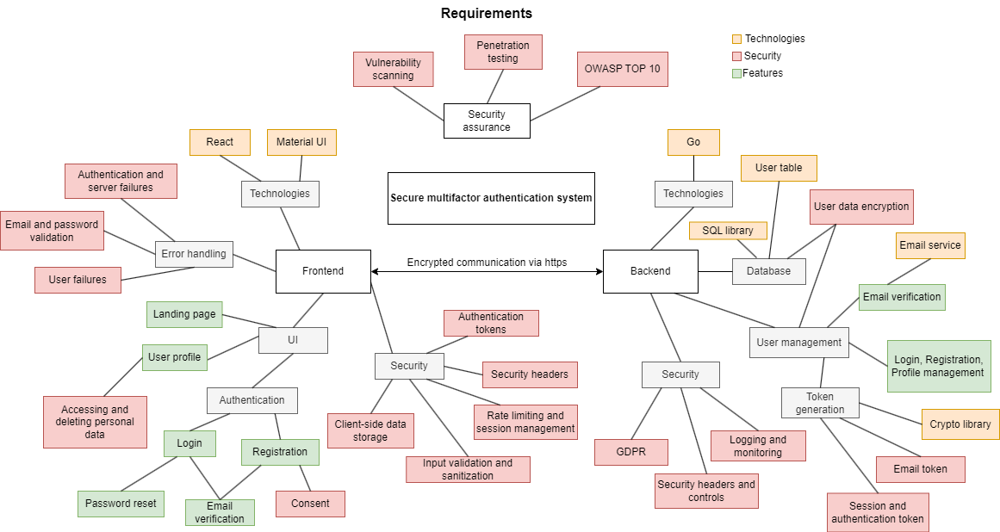

# MFAuthenticator
Multifactor authenticator web application following secure programming guidelines. The application aims to provide maximum security and high quality for a user-friendly authentication service.
## Backend
Go backend for performance and security. It handles the authentication logic including user registration, login, logout, password hashing, token generation, and verification with API endpoints. As well as logging and monitoring, and security measures. Multi-factor authentication is handled with email verification system. Database connection is handled with PostgreSQL that needs to be installed on device and connected to for the application work.

## Frontend
Simple but polished React frontend for user interactions and secure connection with the backend. Includes components for registration and login form with email-verifications, password reset form, and user profile management.

Running the frontend requires you to have node.js and a package manager like npm installed on your machine. Install the necessary packages using npm install and start the program with npm start in the directory.

Both the frontend and the backend need to be running in order for the program to work.

## Security measures implemented
List of secure programming solutions implemented to the application
### Consent of the data subject
Every user who registers to the application is explicitly shown the conditions for the usage of the application. The consent is unchecked by default and the registration requires checking the consent box in order to work.
### User information and password validition on client and server
Includes password strength validation, email formatting and uniqueness, limits for input sizes and password confirmation.
### Error handling
Server errors are displayed with error message and appropriate HTTP code. If methods fail due to user failures, errors are handled and displayed to guide the user.